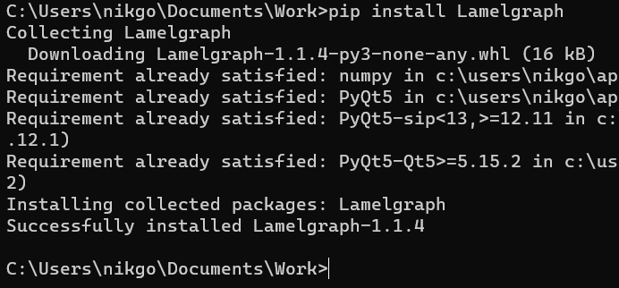

# Lamel_project_copy
<h2>1) Introduction</h2>

Цель проекта в обработке и наглядной визуалиции данных, которые харктеризуют движение в жидкости, в частности движение пузырей воздуха в воде. Кроме визуальной оболочки, приложение так же представляет функционал для работы с информацией и обработку событий.

<h2>2) Instalation</h2>
</img>
<h2>3) Processing for data</h2>

