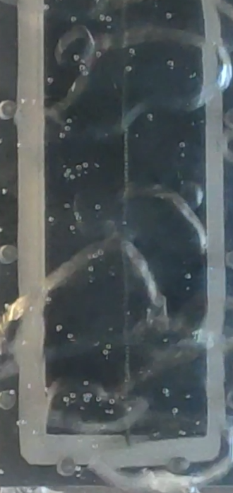

# Lamel_project_copy
<h2>1) Introduction</h2>

Цель проекта в обработке и наглядной визуалиции данных, которые харктеризуют движение в жидкости, в частности движение пузырей воздуха в воде. Кроме визуальной оболочки, приложение так же представляет функционал для работы с информацией и обработку событий.

<h2>2) Instalation</h2>
</img>

Выше представленн пример установки приложения. Так же существует образ для docker

</img>
</img>
<h2>3) Processing for data</h2>

На вход подаётся файл формата .vlt, его можно получить на практике с помощью устройства, называемого f-card

<h4>L-card и пример получения данных</h4>
</img>
</img>
</img>
<h2>4) Problem set<h2>

Оснавная задача - это корректно обработать входной сигнал, построить по нему график и вычислить точное количество событий, скорость для каждого события, среднюю скорость событий, выделить события наглядно на графике. Под событиями подразумеваются появления пузыря воздуха на отдельном из датчиков, в определённый момент времени.

</img>

Важное уточнение, высчитывается не скорость, а проекция скорости на плочкость, в которой находятся датчикки. После корректного преобразования данные можно представить ввиде таблицы.

</img>
<h2>Expectation result</h2>

Результатом же является график, на котором наглядно выделенны события на каждом канале.

</img>

Так же снизу графика будет подписанна средняя скорость, в примере ниже она далека от корректной, т.к. на данный момент не известны размерности в системе.

